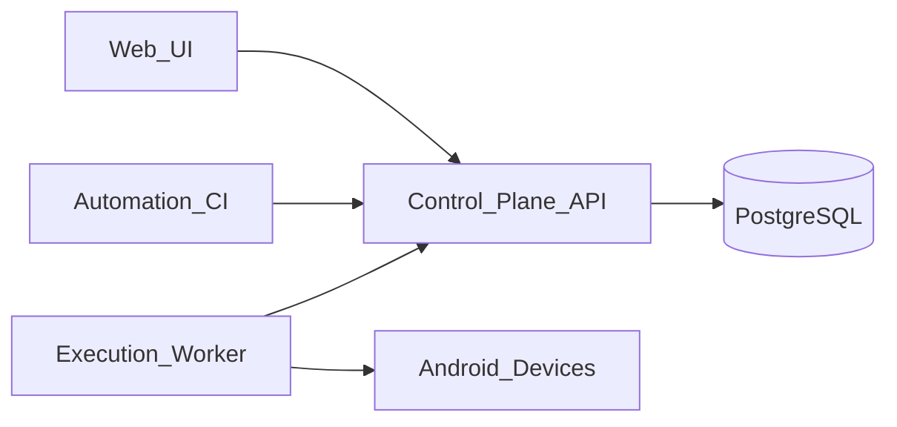

# Zeppole architecture

## Components

- **Control plane API** (`platform/control-plane/api`): REST API under `/api/v1`, JWT auth for users, Bearer tokens for devices (workers). OpenAPI UI at `/api/docs` on the API process (same origin when served behind `zeppole-web` nginx).
- **Web UI** (`platform/control-plane/web`): SPA for projects, cases, cycles, devices, runs; uses the same API as automation (`Authorization: Bearer <jwt>`).
- **Workers** (`platform/execution-workers/worker`): Long-running process that heartbeats, claims `ExecutionJob` rows, and posts results. Replace the stub with Appium / instrumentation wired to your Android pool.
- **Device pool** (`platform/device-pool`): Vendor snapshot for emulator images; production builds should publish `zeppole-emulator` from your registry (see `platform/device-pool/README.md`).

## Data model (summary)

- **Project** → **TestCase**, **TestCycle** (ordered via **CycleItem**).
- **Run** references a cycle; **ExecutionJob** ties a run to a **Device**; **TestResult** stores per-case outcomes per device.
- **Webhook** stores operator-configured callbacks (dispatched when you extend the job completion path).

## API parity

Every GUI workflow maps to `/api/v1/*` routes; use OpenAPI for machine clients.
